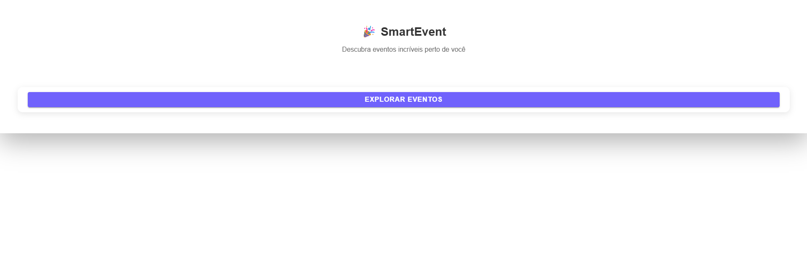
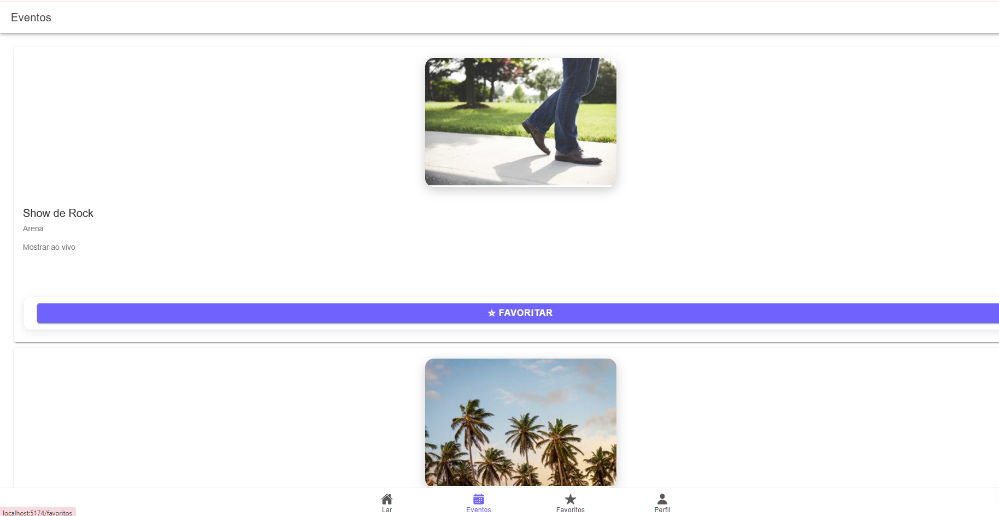
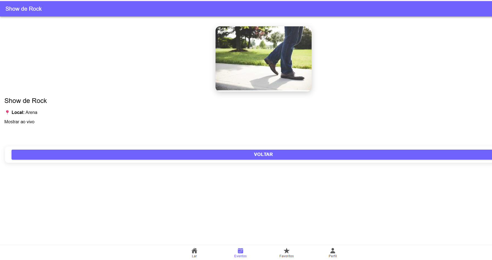
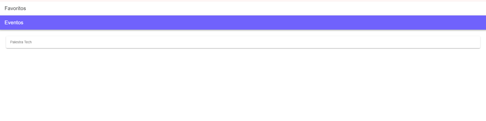
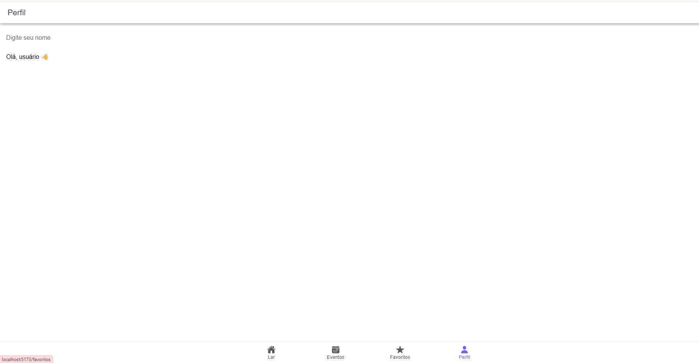

# 🎉 SmartEvent

Aplicativo desenvolvido com Ionic + Vue para visualização de eventos.

## 🚀 Funcionalidades
- 📋 Listagem de eventos
- 🔍 Tela de detalhes
- ⭐ Favoritar eventos
- 💾 Persistência com localStorage

## 🛠️ Tecnologias
- Ionic
- Vue 3
- Vue Router

## 📸 Screenshots

https://github.com/user-attachments/assets/54a73f75-8b3d-4df7-9bff-c85943360b40








## ▶️ Como rodar
```bash
npm install
npm run dev
---

## 👉 Depois:

```bash
git add README.md
git commit -m "docs: adiciona README do projeto"
git push
